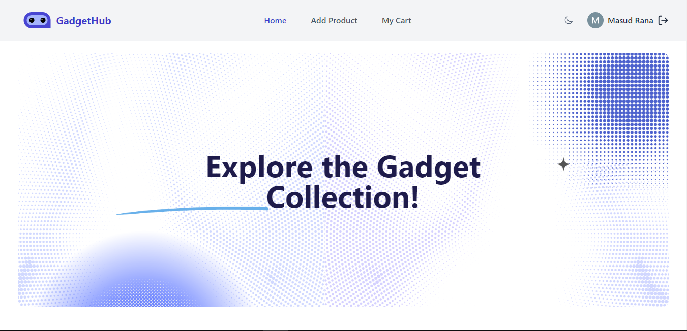

<h1 align="center">GadgetHub With React, Node.js, MongoDB, Firebase</h1>

- Browse a Vast Catalog: Explore a diverse range of tech products, from cutting-edge gadgets to accessories, conveniently categorized for easy navigation.

## 📝 Features

- <b>Credentials authentication with Firebase: </b> Securely log in and register using your email and password.
- <b>Google authentication: </b> Log in with your Google account.
- <b>Database: </b> To store user data, product information use MongoDB database.
- <b>User friendly react toast message: </b> Get friendly notifications for important actions.
- <b>Responsive mobile navbar: </b> Access the website easily on your mobile device with a user-friendly navigation menu.
- <b>Full responsivity and mobile UI: </b>The website is fully responsive, the ui is different on desktop and mobile devices.

## 🚀 Live Link

[https://brand-shop-3f426.web.app/](https://brand-shop-3f426.web.app/)
